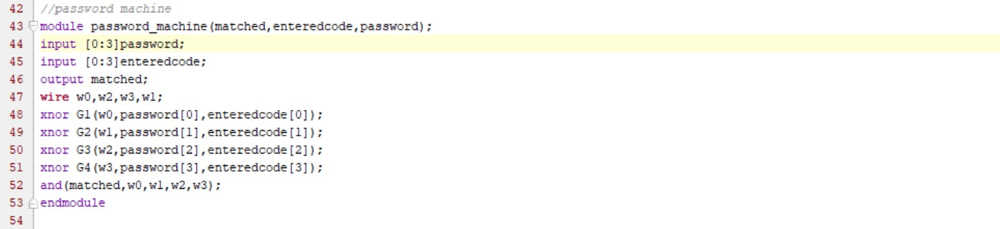
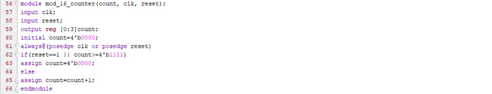
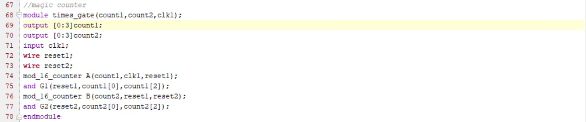
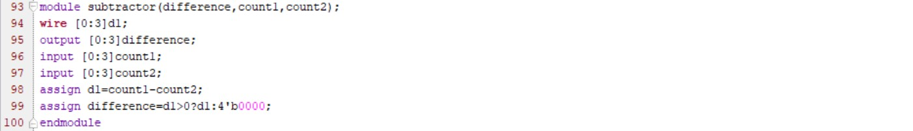
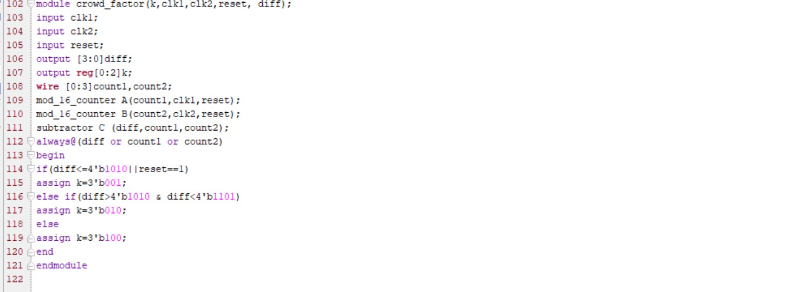
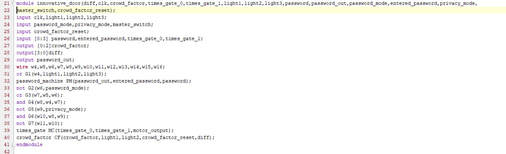
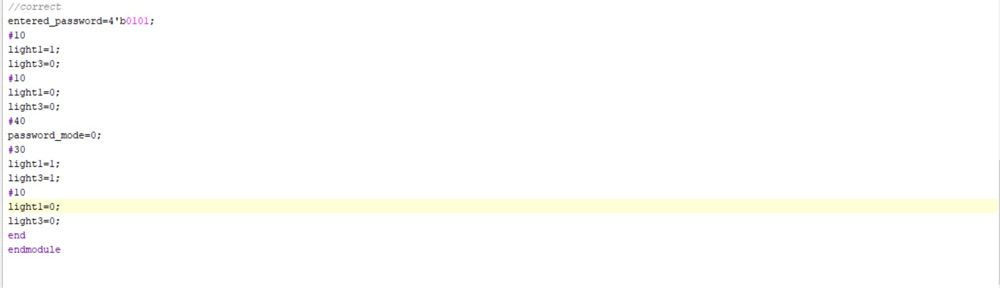
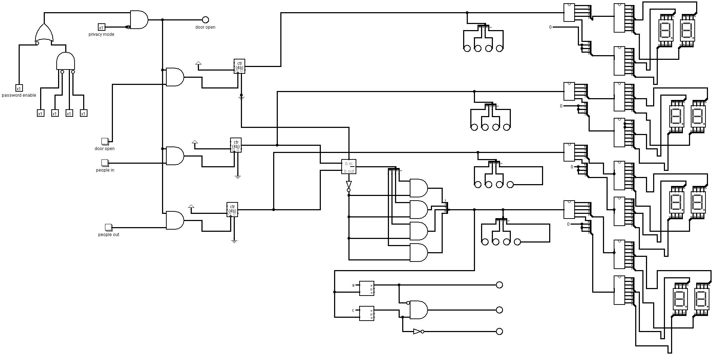
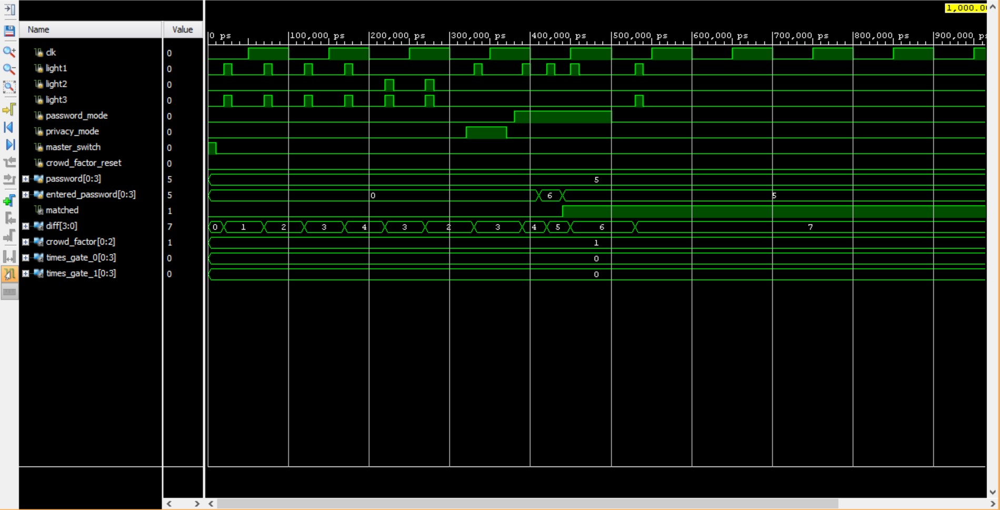

### Mentors

- Abhiram Chivukula
- Yanvitha Totakura

### Members

- Dayakar Satya Sai Jagata 
- Manjush K
- Radhika S
- Sutanuja 

## Aim

To design a multi-feature electronic door system using Verilog and Logisim.

## Introduction:

The project consists of an electronic door handle system which uses the basic principles of digital electronics, implements a variety of features, keeping in mind the recent coronavirus pandemic situation. The various features of the door are studied from the simulations obtained in the Verilog implementation as well as the Logisim model.

## Tools and software used:

1. Verilog: A hardware description language (HDL) used to model and simulate the digital circuits. The Xilinx Vivado 2016 Version is used to design and simulate the various features of the door.

2. Logisim: A graphical system for logical circuit design and simulation.

## Features of the Electronic Door:

1. Password Verification: The password verification machine in digital electronics is based on the property of XNOR gates. The output returned is 1 only when both the inputs are the same. The password can be inputted and if it matches, then the door is accessible to the user.

2. Magic Counter: Another feature of our Door is the Magic Counter. It is a counter that displays the number of times the gate has been used. It is done using 7 segment displays. The Binary Counter gets the pulse from the clock and these pulses get added up. To display it, as a two digit number, another Binary Counter is implemented.

3. Crowd factor Calculator: The next feature of this electronic door is the detection of the number of people inside the room, and hence glow a led with specific color coordination. 

The status of crowdedness in the room is indicated by green if there are fewer crowds, yellow if there is moderate crowd and red if the room is crowded.

To find the relative amount of crowdedness two counters are used.
Then their difference is taken using a subtractor. The difference between the number of people entered and the number of people left gives the number of people in the room. This number is compared with the comparator and then using a priority encoder, the appropriate led color is shown.

4. Privacy Mode feature: One of the interesting features of the door is the Privacy Mode. Here, the user gets the access to lock the door from inside. The door stays closed until the privacy mode is turned off. This is implemented using simple logic gates. When the logic state is set to 1(privacy mode on), the NOT of it is 0 and when passed through an AND gate, the output is 0 and hence the door is closed. When the logic state is set to 0, and if the password entered is also correct then the total output is 1 and hence the door is opened and the Privacy Mode will be turned off.

### Verilog Implementation: The various features of the door are implemented as separate modules, and are then instantiated in the main module. The various levels of modeling such as gate level, data flow and behavioral modeling are used. The Verilog codes for each are shown below.
 
  	1. Password Machine: This module is implemented using the gate level modeling making use of XNOR gates along with an AND gate.

  
  
	2. Mod 16 Counter: It is a 4 bit counter that counts from 0 to 15 (16 states),and resets back to 0 after the 16th state is completed.

	3. Magic Counter: Designed using behavioral modeling, the magic counter makes use of the mod_16_counter module to find out the number of times the gate has been opened.

	4.Subtractor: This module finds the difference between the two inputs and assigns the value only if the difference is positive.

5.Crowd Factor Calculator: This module calculates the crowd in the room and glows one of the three lights accordingly.The crowd is calculated by finding the difference between the number of people entering the room and the number of people leaving.This is implemented by using two instances of the mod_16_counter  module and one instance of the subtractor module.

	6.Top level module: The main module named “innovative_door” contains all the other sub-modules which are instantiated here to make the design complete.

TESTBENCH: The verilog testbench implemented below is used to verify,analyze and simulate the functionality of the created design. All the various modes and features of the door are tested by specifying the values in the testbench.

### Simulations and Outputs:

The simulation of the various features of the electronic door as obtained in Logisim is shown below.

The simulation as obtained in Verilog is displayed below. As seen ,it consists of the various modes such as the privacy mode,password mode and displays all the relevant outputs which include the crowd factor, the password matched output which is 1 when the entered code matches the password and also consists of the number of times the gate has been opened.

### Future Prospects: The future prospects of this project include adding other salient features such as:

1. Theft detection:  When this mode is on, the door remains closed and a message is sent to the user to reset the password.

2. Hazard detection system: When a hazard is detected by the system, the door is kept fully open during hazards and emergency situations in order to not pose an obstacle during escape. It also quickly warns the user regarding the hazard. 

3. Connection with other IoT appliances in the Room: This integrates the door system with other IoT systems, thereby making it more seamless and connected.

 

### Conclusion: 
In this project, we have created various modules in Verilog to design and simulate the different features of this door. Through this project the members have gained knowledge on the various combinational and sequential circuits used in implementing this project.

### References

1. Github [Link]( https://github.com/ayush-agarwal-0502/Innovative-Electronic-Door/tree/main)
2. Digital Design by Morris Mano

